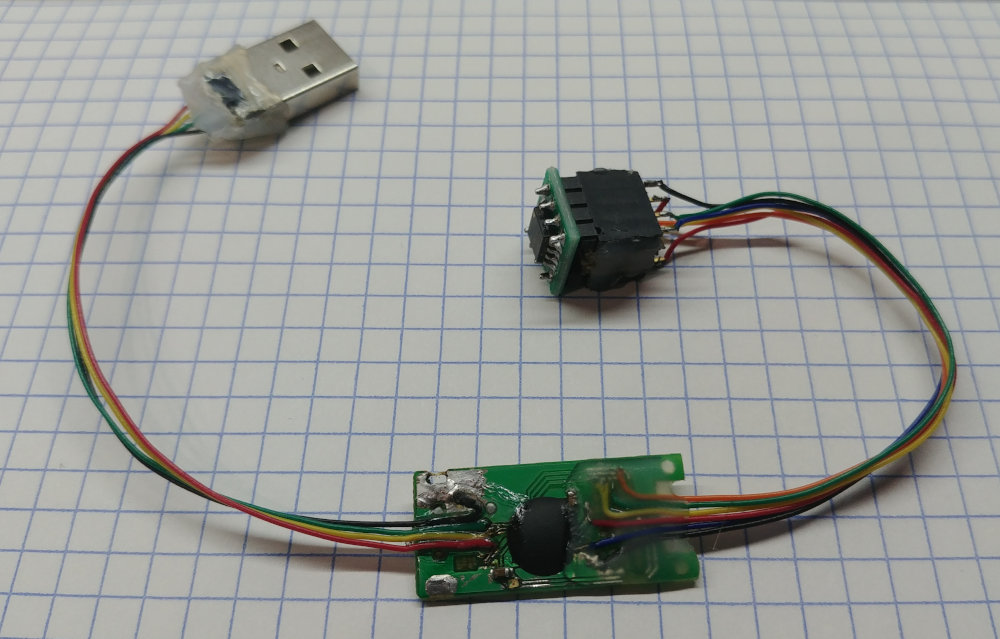

# The SPI flash drive

- [SPI flash dump](uf_header.lhex) - the FAT section is omitted, and it is altered.. (the usb string descriptors, that's it)
- [Firmware layout](fwlay.md)

## Currently..

I repurposed it into a SPI Flasher..

